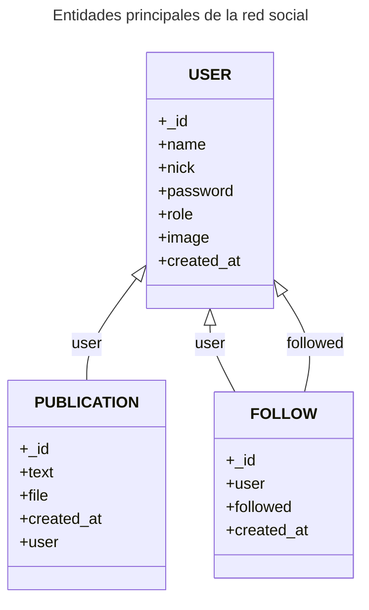

Crear proyecto
```
npm init
name       : Express_api_red_social
descripcion: API REST con Node, Mongo, Express, JWT para una red social
licencia   : MIT

npm i express mongoose mongoose-pagination multer moment validator bcrypt jwt-simple cors 
npm i -D nodemon
```

Iniciar proyecto 
```
npm start
npm run debug
```


